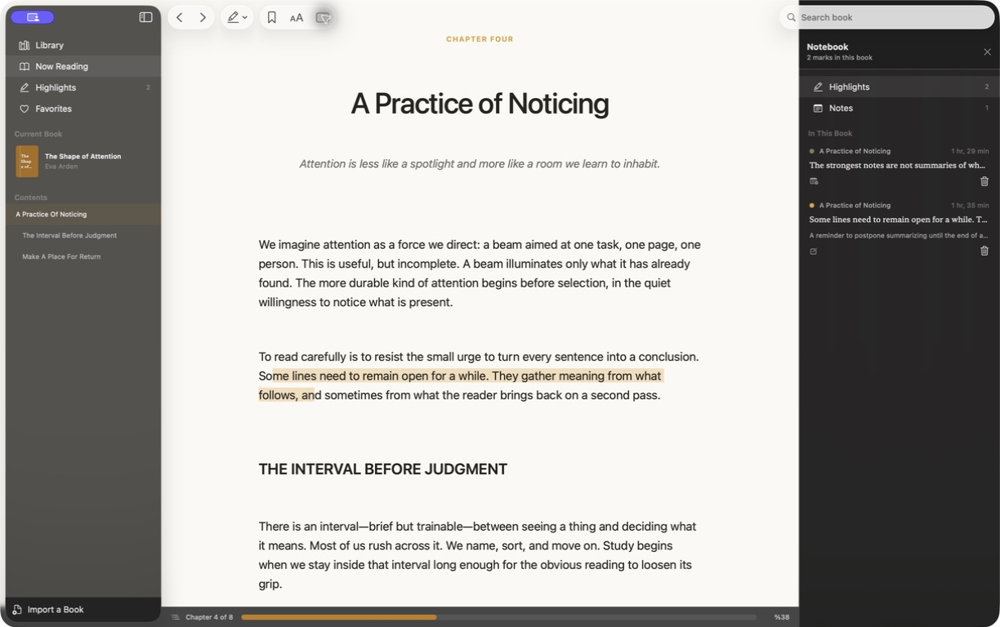

<p align="center">
  
</p>

<h1 align="center">Leaf Native</h1>

<p align="center">
  A calm, genuinely native macOS reader for deep reading, highlights, and notes.
</p>

<p align="center">
  <a href="https://github.com/FurkanCodes/LeafNative/releases/latest"></a>
  
  
  
</p>

<p align="center">
  <a href="https://github.com/FurkanCodes/LeafNative/releases/latest"><strong>Download for macOS</strong></a>
</p>



Leaf keeps the book at the center. Its three-pane workspace gives the library, reader, and notebook equal dignity, while every pane can get out of the way when you want to focus.

## Why Leaf

- **Native by design** — SwiftUI, AppKit, PDFKit, and SwiftData; no Electron, WebView, or browser shell.
- **Notebook or AI beside the page** — collect notes, ask about a selection, and follow citations back to the document without leaving the reader.
- **Research companion** — local conversations per book, streamed Markdown answers, passage retrieval, and scholarly paper discovery with DOI metadata checked against Crossref.
- **Fast, deliberate highlighting** — select text, choose Amber, Sage, or Rose, and keep reading.
- **Highlights that lead somewhere** — click a saved highlight to jump directly back to its passage.
- **Real PDF annotations** — PDF highlights are written into the document and can be removed from Leaf.
- **Useful contents navigation** — EPUB structure and PDF outlines become a navigable table of contents.
- **Local-first library** — books, progress, bookmarks, highlights, and notes stay on your Mac.
- **Made for macOS** — system menus, keyboard shortcuts, contextual actions, materials, and accessibility.

## Supported formats

| Experience | Formats |
| --- | --- |
| Built-in reader | PDF, EPUB, TXT, Markdown, HTML, RTF/RTFD, FB2, DOCX, CBZ |
| Text extraction | MOBI, AZW, AZW3 (common unencrypted PalmDOC variants) |
| System preview fallback | CBR, DOC, and uncommon document variants |

DRM-protected Kindle and EPUB files require authorization from their vendor and are not supported.

## Keyboard shortcuts

| Action | Shortcut |
| --- | --- |
| Import a book | `⌘O` |
| Find in book | `⌘F` |
| Highlight selection | `⇧⌘H` |
| Highlight with a note | `⇧⌘N` |
| Previous / next page | `←` / `→` |

## Install

1. Download the latest DMG from [Releases](https://github.com/FurkanCodes/LeafNative/releases/latest).
2. Open it and drag **Leaf Native** into **Applications**.
3. On first launch, right-click the app and choose **Open** if macOS shows a Gatekeeper warning.

The downloadable build is ad-hoc signed for this first public release. It is not yet Developer ID signed or notarized.

## Build from source

Leaf requires macOS 15 or later and Xcode 26, or another compatible Swift 6.2 toolchain.

```bash
git clone https://github.com/FurkanCodes/LeafNative.git
cd LeafNative
./scripts/build-app.sh
open "dist/Leaf Native.app"
```

The script builds and ad-hoc signs a local app bundle. Run it again after source changes before reopening the app.

### Connect Gemini

Choose **Gemini** in Settings → AI Assistant. Create a key in [Google AI Studio](https://aistudio.google.com/api-keys), paste it into Leaf, and select a model. The key is stored in macOS Keychain and its Google Cloud project owns the API quota and billing.

A Gemini app subscription does not cover Gemini API requests. **Gemini Deep Research** is a separate background agent that may take several minutes and incur higher per-task costs. Leaf cancels a running agent when you press Stop and requests deletion of its remote interaction after completion or cancellation.

To create the DMG and ZIP used for a release:

```bash
./scripts/build-release.sh 1.3.0
```

## Native architecture

| Layer | Technology |
| --- | --- |
| App shell and navigation | SwiftUI |
| Selectable reflowable text | AppKit `NSTextView` |
| PDF rendering and annotations | PDFKit |
| Library and reading state | SwiftData |
| Container formats | ZIPFoundation |
| Assistant Markdown | swift-markdown |
| System document fallback | Quick Look |

ZIPFoundation unpacks EPUB, DOCX, and CBZ containers. swift-markdown parses assistant responses for native rendering.

## Privacy

Leaf has no Leaf account, analytics, advertising, or Leaf-operated cloud backend. Imported books, reading data, and conversations are stored locally on your Mac. Passage retrieval, including meaning-based search with Apple's NaturalLanguage embeddings, runs entirely on device; its search vectors are cached in `~/Library/Application Support/Leaf/ResearchIndex`. Apple Intelligence processes assistant requests on device. If you select OpenAI API or ChatGPT account, the question and retrieved book passages are sent to OpenAI. If you select Gemini, those passages and questions are sent to Google's Gemini API; standard model requests disable server-side interaction storage. Deep Research requires temporary background interaction storage at Google, which Leaf requests to delete when the task finishes or is stopped. Paper searches send the search terms to OpenAlex and DOI lookups to Crossref; metadata confirmation does not verify a paper's findings. API keys and OAuth tokens are stored in the macOS Keychain. The ChatGPT account integration uses Codex OAuth and its private backend, so OpenAI may change or restrict it.

## License

This repository does not currently include an open-source license.
